# 跟单回测功能技术设计文档

## 一、技术架构概览

```mermaid
graph TB
    subgraph "Frontend Layer"
        A[回测管理页面] --> B[回测创建页面]
        A --> C[回测详情页面]
    end
    
    subgraph "Backend API Layer"
        D[BacktestController]
    end
    
    subgraph "Service Layer"
        E[BacktestService] --> F[BacktestExecutionService]
        E --> G[BacktestDataService]
        F --> H[CopyTradingFilterService]
    end
    
    subgraph "Scheduled Tasks"
        I[BacktestPollingService]
    end
    
    subgraph "Data Layer"
        J[(Backtest Task Table)]
        K[(Backtest Trade Table)]
        L[(Leader Historical Data)]
    end
    
    A --> D
    B --> D
    C --> D
    D --> E
    I --> F
    E --> J
    F --> K
    F --> L
    G --> L
    F --> H
```



## 二、数据库设计

### 2.1 回测任务表 (backtest_task)

```sql
CREATE TABLE backtest_task (
    id BIGINT AUTO_INCREMENT PRIMARY KEY COMMENT '回测任务ID',
    task_name VARCHAR(100) NOT NULL COMMENT '回测任务名称',
    leader_id BIGINT NOT NULL COMMENT 'Leader ID',
    initial_balance DECIMAL(20, 8) NOT NULL COMMENT '初始资金',
    final_balance DECIMAL(20, 8) DEFAULT NULL COMMENT '最终资金',
    profit_amount DECIMAL(20, 8) DEFAULT NULL COMMENT '收益金额',
    profit_rate DECIMAL(10, 4) DEFAULT NULL COMMENT '收益率(%)',
    backtest_days INT NOT NULL COMMENT '回测天数',
    start_time BIGINT NOT NULL COMMENT '回测开始时间(历史时间)',
    end_time BIGINT DEFAULT NULL COMMENT '回测结束时间(历史时间)',
    
    -- 跟单配置 (复制CopyTrading表结构)
    copy_mode VARCHAR(10) NOT NULL COMMENT '跟单模式: RATIO/FIXED',
    copy_ratio DECIMAL(20, 8) DEFAULT 1.0 COMMENT '跟单比例',
    fixed_amount DECIMAL(20, 8) DEFAULT NULL COMMENT '固定金额',
    max_order_size DECIMAL(20, 8) NOT NULL COMMENT '最大单笔订单',
    min_order_size DECIMAL(20, 8) NOT NULL COMMENT '最小单笔订单',
    max_daily_loss DECIMAL(20, 8) NOT NULL COMMENT '最大每日亏损',
    max_daily_orders INT NOT NULL COMMENT '最大每日订单数',
    price_tolerance DECIMAL(5, 2) NOT NULL COMMENT '价格容忍度(%)',
    delay_seconds INT DEFAULT 0 COMMENT '延迟秒数',
    support_sell BOOLEAN DEFAULT TRUE COMMENT '是否支持卖出',
    min_order_depth DECIMAL(20, 8) DEFAULT NULL COMMENT '最小订单深度',
    max_spread DECIMAL(20, 8) DEFAULT NULL COMMENT '最大价差',
    min_price DECIMAL(20, 8) DEFAULT NULL COMMENT '最低价格',
    max_price DECIMAL(20, 8) DEFAULT NULL COMMENT '最高价格',
    max_position_value DECIMAL(20, 8) DEFAULT NULL COMMENT '最大仓位金额',
    max_position_count INT DEFAULT NULL COMMENT '最大仓位数量',
    keyword_filter_mode VARCHAR(20) DEFAULT 'DISABLED' COMMENT '关键字过滤模式',
    keywords JSON DEFAULT NULL COMMENT '关键字列表',
    max_market_end_date BIGINT DEFAULT NULL COMMENT '市场截止时间限制',
    
    -- 执行状态
    status VARCHAR(20) NOT NULL DEFAULT 'PENDING' COMMENT '状态: PENDING/RUNNING/COMPLETED/STOPPED/FAILED',
    progress INT DEFAULT 0 COMMENT '执行进度(0-100)',
    total_trades INT DEFAULT 0 COMMENT '总交易笔数',
    buy_trades INT DEFAULT 0 COMMENT '买入笔数',
    sell_trades INT DEFAULT 0 COMMENT '卖出笔数',
    win_trades INT DEFAULT 0 COMMENT '盈利交易笔数',
    loss_trades INT DEFAULT 0 COMMENT '亏损交易笔数',
    win_rate DECIMAL(5, 2) DEFAULT NULL COMMENT '胜率(%)',
    max_profit DECIMAL(20, 8) DEFAULT NULL COMMENT '最大单笔盈利',
    max_loss DECIMAL(20, 8) DEFAULT NULL COMMENT '最大单笔亏损',
    max_drawdown DECIMAL(20, 8) DEFAULT NULL COMMENT '最大回撤',
    error_message TEXT DEFAULT NULL COMMENT '错误信息',
    
    created_at BIGINT NOT NULL COMMENT '创建时间',
    execution_started_at BIGINT DEFAULT NULL COMMENT '执行开始时间(系统时间)',
    execution_finished_at BIGINT DEFAULT NULL COMMENT '执行完成时间(系统时间)',
    updated_at BIGINT NOT NULL COMMENT '更新时间',
    
    INDEX idx_leader_id (leader_id),
    INDEX idx_status (status),
    INDEX idx_created_at (created_at)
) COMMENT='回测任务表';
```

### 2.2 回测交易记录表 (backtest_trade)

```sql
CREATE TABLE backtest_trade (
    id BIGINT AUTO_INCREMENT PRIMARY KEY COMMENT '交易记录ID',
    backtest_task_id BIGINT NOT NULL COMMENT '回测任务ID',
    trade_time BIGINT NOT NULL COMMENT '交易时间',
    market_id VARCHAR(100) NOT NULL COMMENT '市场ID',
    market_title VARCHAR(500) DEFAULT NULL COMMENT '市场标题',
    side VARCHAR(20) NOT NULL COMMENT '方向: BUY/SELL/SETTLEMENT',
    outcome VARCHAR(50) NOT NULL COMMENT '结果: YES/NO或outcomeIndex',
    quantity DECIMAL(20, 8) NOT NULL COMMENT '数量',
    price DECIMAL(20, 8) NOT NULL COMMENT '价格',
    amount DECIMAL(20, 8) NOT NULL COMMENT '金额',
    fee DECIMAL(20, 8) NOT NULL COMMENT '手续费',
    profit_loss DECIMAL(20, 8) DEFAULT NULL COMMENT '盈亏(仅卖出时)',
    balance_after DECIMAL(20, 8) NOT NULL COMMENT '交易后余额',
    leader_trade_id VARCHAR(100) DEFAULT NULL COMMENT 'Leader原始交易ID',
    
    created_at BIGINT NOT NULL COMMENT '创建时间',
    
    INDEX idx_backtest_task_id (backtest_task_id),
    INDEX idx_trade_time (trade_time),
    FOREIGN KEY (backtest_task_id) REFERENCES backtest_task(id) ON DELETE CASCADE
) COMMENT='回测交易记录表';
```

### 2.3 索引优化建议

- `backtest_task`: 
  - 主查询索引: `idx_leader_id`, `idx_status`
  - 排序索引: `idx_created_at`
- `backtest_trade`:
  - 关联查询索引: `idx_backtest_task_id`
  - 时间序列索引: `idx_trade_time`

## 三、API设计

### 3.1 RESTful API规范

#### 3.1.1 创建回测任务

```
POST /api/backtest/tasks
```

**Request Body**:
```json
{
  "taskName": "激进策略-Leader A",
  "leaderId": 123,
  "initialBalance": "1000.00",
  "backtestDays": 30,
  "copyMode": "RATIO",
  "copyRatio": "1.0",
  "fixedAmount": null,
  "maxOrderSize": "1000.00",
  "minOrderSize": "1.00",
  "maxDailyLoss": "10000.00",
  "maxDailyOrders": 100,
  "priceTolerance": "5.00",
  "delaySeconds": 0,
  "supportSell": true,
  "minOrderDepth": null,
  "maxSpread": null,
  "minPrice": null,
  "maxPrice": null,
  "maxPositionValue": null,
  "maxPositionCount": null,
  "keywordFilterMode": "DISABLED",
  "keywords": [],
  "maxMarketEndDate": null
}
```

**Response**:
```json
{
  "success": true,
  "data": {
    "id": 12345,
    "taskName": "激进策略-Leader A",
    "status": "PENDING",
    "createdAt": 1738238400000
  },
  "message": "回测任务创建成功"
}
```

#### 3.1.2 查询回测任务列表

```
GET /api/backtest/tasks?leaderId={leaderId}&status={status}&sortBy={field}&sortOrder={asc|desc}&page={page}&size={size}
```

**Query Parameters**:
- `leaderId` (可选): Leader ID
- `status` (可选): PENDING/RUNNING/COMPLETED/STOPPED/FAILED
- `sortBy` (可选): profitAmount / profitRate / createdAt (默认: createdAt)
- `sortOrder` (可选): asc / desc (默认: desc)
- `page` (可选): 页码,从1开始 (默认: 1)
- `size` (可选): 每页数量 (默认: 20)

**Response**:
```json
{
  "success": true,
  "data": {
    "list": [
      {
        "id": 12345,
        "taskName": "激进策略-Leader A",
        "leaderId": 123,
        "leaderName": "Smart Trader",
        "leaderAddress": "0x123...",
        "initialBalance": "1000.00",
        "finalBalance": "1250.00",
        "profitAmount": "250.00",
        "profitRate": "25.00",
        "backtestDays": 30,
        "totalTrades": 45,
        "status": "COMPLETED",
        "startTime": 1735646400000,
        "endTime": 1738238400000,
        "createdAt": 1738238400000
      }
    ],
    "total": 100,
    "page": 1,
    "size": 20
  }
}
```

#### 3.1.3 查询回测任务详情

```
GET /api/backtest/tasks/{id}
```

**Response**:
```json
{
  "success": true,
  "data": {
    "id": 12345,
    "taskName": "激进策略-Leader A",
    "leaderId": 123,
    "leaderName": "Smart Trader",
    "initialBalance": "1000.00",
    "finalBalance": "1250.00",
    "profitAmount": "250.00",
    "profitRate": "25.00",
    "backtestDays": 30,
    "startTime": 1735646400000,
    "endTime": 1738238400000,
    "config": {
      "copyMode": "RATIO",
      "copyRatio": "1.0",
      // ... 其他配置
    },
    "statistics": {
      "totalTrades": 45,
      "buyTrades": 23,
      "sellTrades": 22,
      "winTrades": 30,
      "lossTrades": 15,
      "winRate": "66.67",
      "maxProfit": "50.00",
      "maxLoss": "-20.00",
      "maxDrawdown": "100.00"
    },
    "status": "COMPLETED",
    "progress": 100,
    "createdAt": 1738238400000
  }
}
```

#### 3.1.4 查询回测交易记录

```
GET /api/backtest/tasks/{id}/trades?page={page}&size={size}
```

**Response**:
```json
{
  "success": true,
  "data": {
    "list": [
      {
        "id": 1,
        "tradeTime": 1735646400000,
        "marketTitle": "BTC > $100k",
        "side": "BUY",
        "outcome": "YES",
        "quantity": "100.00",
        "price": "0.65",
        "amount": "65.00",
        "fee": "0.13",
        "profitLoss": null,
        "balanceAfter": "934.87"
      }
    ],
    "total": 45,
    "page": 1,
    "size": 20
  }
}
```

#### 3.1.5 删除回测任务

```
DELETE /api/backtest/tasks/{id}
```

**Response**:
```json
{
  "success": true,
  "message": "回测任务删除成功"
}
```

#### 3.1.6 停止运行中的回测

```
POST /api/backtest/tasks/{id}/stop
```

**Response**:
```json
{
  "success": true,
  "message": "回测任务已停止"
}
```

## 四、后端服务设计

### 4.1 Service层架构

#### 4.1.1 BacktestService

**职责**: 回测任务的CRUD操作

**核心方法**:
```kotlin
interface BacktestService {
    // 创建回测任务
    fun createBacktestTask(request: BacktestCreateRequest): Result<BacktestTaskDto>
    
    // 查询回测任务列表
    fun getBacktestTaskList(request: BacktestListRequest): Result<BacktestListResponse>
    
    // 查询回测任务详情
    fun getBacktestTaskDetail(taskId: Long): Result<BacktestTaskDetailDto>
    
    // 删除回测任务
    fun deleteBacktestTask(taskId: Long): Result<Unit>
    
    // 停止回测任务
    fun stopBacktestTask(taskId: Long): Result<Unit>
    
    // 查询回测交易记录
    fun getBacktestTrades(taskId: Long, page: Int, size: Int): Result<BacktestTradeListResponse>
}
```

**实现要点**:
- 复用 `CopyTradingFilterService` 的参数验证逻辑
- 使用 `@Transactional` 保证数据一致性
- 返回值使用 `Result<T>` 统一错误处理

#### 4.1.2 BacktestExecutionService

**职责**: 执行回测任务

**核心方法**:
```kotlin
interface BacktestExecutionService {
    // 执行回测任务
    suspend fun executeBacktest(task: BacktestTask)
    
    // 获取Leader历史交易
    suspend fun getLeaderHistoricalTrades(
        leaderId: Long, 
        startTime: Long, 
        endTime: Long
    ): List<HistoricalTrade>
    
    // 模拟交易执行
    suspend fun simulateTrade(
        task: BacktestTask,
        trade: HistoricalTrade,
        currentBalance: BigDecimal,
        positions: MutableMap<String, Position>
    ): TradeResult
    
    // 计算收益统计
    fun calculateStatistics(trades: List<BacktestTrade>): BacktestStatistics
}
```

**执行流程**:


#### 4.1.3 BacktestDataService

**职责**: 获取Leader历史数据

**数据源**:
1. **优先使用**: `ProcessedTrade` 表 (系统已记录的交易)
2. **补充数据**: Polymarket API (获取更早的历史数据)

**API调用**:
```kotlin
// Polymarket Trade History API
// GET https://data-api.polymarket.com/trades?maker={address}&start_ts={startTime}&end_ts={endTime}
```

**缓存策略**:
- 使用 Redis 缓存历史交易数据,TTL = 1小时
- Key格式: `backtest:leader:{leaderId}:trades:{startTime}:{endTime}`

#### 4.1.4 BacktestPollingService

**职责**: 轮询待执行的回测任务

**实现方式**:
```kotlin
@Service
class BacktestPollingService(
    private val backtestTaskRepository: BacktestTaskRepository,
    private val executionService: BacktestExecutionService
) {
    private val logger = LoggerFactory.getLogger(BacktestPollingService::class.java)
    private val executor = Executors.newFixedThreadPool(5) // 最多5个并发任务
    
    @Scheduled(fixedDelay = 10000) // 每10秒轮询一次
    fun pollPendingTasks() {
        val pendingTasks = backtestTaskRepository.findByStatus("PENDING")
        
        pendingTasks.forEach { task ->
            executor.submit {
                try {
                    runBlocking {
                        executionService.executeBacktest(task)
                    }
                } catch (e: Exception) {
                    logger.error("回测任务执行失败: ${task.id}", e)
                    backtestTaskRepository.updateStatus(task.id!!, "FAILED", e.message)
                }
            }
        }
    }
}
```

**并发控制**:
- 线程池大小: 5
- 超出并发数的任务保持 `PENDING` 状态,下次轮询继续执行

### 4.2 核心算法

#### 4.2.1 回测算法伪代码

```kotlin
fun executeBacktest(task: BacktestTask) {
    // 1. 初始化
    var currentBalance = task.initialBalance
    val positions = mutableMapOf<String, Position>() // marketId + outcome -> Position
    val trades = mutableListOf<BacktestTrade>()
    val marketInfoCache = mutableMapOf<String, MarketInfo>() // 缓存市场信息
    
    // 2. 计算回测时间范围
    val endTime = System.currentTimeMillis()
    val startTime = endTime - (task.backtestDays * 24 * 3600 * 1000)
    
    // 3. 获取Leader历史交易
    val leaderTrades = getLeaderHistoricalTrades(task.leaderId, startTime, endTime)
    
    // 4. 按时间顺序回放交易
    for (leaderTrade in leaderTrades.sortedBy { it.timestamp }) {
        
        // ✨ 4.1 实时检查并结算已到期的市场
        val expiredPositions = positions.filter { (positionKey, position) ->
            val marketInfo = marketInfoCache.getOrPut(position.marketId) {
                try {
                    marketService.getMarketInfo(position.marketId)
                } catch (e: Exception) {
                    logger.warn("无法获取市场${position.marketId}信息", e)
                    null
                }
            }
            
            // 检查市场是否已到结束时间
            marketInfo?.endDate != null && marketInfo.endDate <= leaderTrade.timestamp
        }
        
        // 结算已到期的市场
        for ((positionKey, position) in expiredPositions) {
            val marketInfo = marketInfoCache[position.marketId]!!
            
            val settlementPrice = when {
                marketInfo.winner == position.outcome -> BigDecimal.ONE  // 胜出方
                marketInfo.winner != null -> BigDecimal.ZERO  // 失败方
                else -> position.avgPrice  // 未结算,按成本价保守估计
            }
            
            val settlementValue = position.quantity * settlementPrice
            val profitLoss = settlementValue - (position.quantity * position.avgPrice)
            
            currentBalance += settlementValue
            
            // 记录结算交易
            trades.add(BacktestTrade(
                backtestTaskId = task.id!!,
                tradeTime = marketInfo.endDate,
                marketId = position.marketId,
                side = "SETTLEMENT",
                outcome = position.outcome,
                quantity = position.quantity,
                price = settlementPrice,
                amount = settlementValue,
                fee = BigDecimal.ZERO,
                profitLoss = profitLoss,
                balanceAfter = currentBalance
            ))
            
            // 移除已结算的持仓
            positions.remove(positionKey)
            
            logger.info("市场到期结算: ${position.marketId}, 时间: ${marketInfo.endDate}, 结算价: $settlementPrice, 盈亏: $profitLoss")
        }
        
        // 4.2 检查余额和持仓状态
        // ✨ 修正: 只有当"余额不足 且 无持仓"时才停止回测
        // 如果有持仓，继续处理（可能有卖出或市场结算释放资金）
        if (currentBalance < BigDecimal.ONE && positions.isEmpty()) {
            logger.info("余额不足且无持仓，停止回测: $currentBalance")
            break
        }
        
        // 如果余额不足但有持仓，记录日志但继续处理
        if (currentBalance < BigDecimal.ONE && positions.isNotEmpty()) {
            logger.info("余额不足 $currentBalance，但还有 ${positions.size} 个持仓，继续处理后续交易（等待卖出或结算）")
        }
        
        // 4.3 应用过滤规则
        if (!passFilters(task, leaderTrade)) {
            continue
        }
        
        // 4.4 计算跟单金额
        val followAmount = calculateFollowAmount(task, leaderTrade)
        
        if (leaderTrade.side == "BUY") {
            // 买入逻辑
            val quantity = followAmount / leaderTrade.price
            val totalCost = followAmount  // 不计算手续费
            
            // ✨ 严格模式: 仅检查当前可用余额,不考虑持仓市值
            // 理由: 持仓未卖出前资金不可用,这更符合真实场景
            // 注意: 市场到期结算会在步骤4.1中提前释放资金
            if (totalCost > currentBalance) {
                logger.info("余额不足以执行买入订单: 需要 ${totalCost.toPlainString()}, 可用 ${currentBalance.toPlainString()}")
                
                // 记录持仓价值用于分析（但不计入可用余额）
                if (logger.isDebugEnabled) {
                    val positionValue = positions.values.sumOf { it.quantity * it.avgPrice }
                    logger.debug("当前持仓市值: ${positionValue.toPlainString()}, 但资金被占用")
                }
                
                continue
            }
            
            // 更新余额和持仓
            currentBalance -= totalCost
            val positionKey = "${leaderTrade.marketId}:${leaderTrade.outcome}"
            positions[positionKey] = Position(
                marketId = leaderTrade.marketId,
                outcome = leaderTrade.outcome,
                quantity = quantity,
                avgPrice = leaderTrade.price,
                leaderBuyQuantity = leaderTrade.quantity
            )
            
            // 记录交易
            trades.add(BacktestTrade(
                backtestTaskId = task.id!!,
                tradeTime = leaderTrade.timestamp,
                marketId = leaderTrade.marketId,
                side = "BUY",
                outcome = leaderTrade.outcome,
                quantity = quantity,
                price = leaderTrade.price,
                amount = followAmount,
                fee = BigDecimal.ZERO,  // 不计算手续费
                balanceAfter = currentBalance
            ))
            
        } else { // SELL
            if (!task.supportSell) continue
            
            val positionKey = "${leaderTrade.marketId}:${leaderTrade.outcome}"
            val position = positions[positionKey] ?: continue
            
            // 计算卖出数量 (按比例)
            val sellQuantity = if (task.copyMode == "RATIO") {
                // 比例模式: 按Leader卖出比例
                position.quantity * (leaderTrade.quantity / position.leaderBuyQuantity)
            } else {
                // 固定金额模式: 全部卖出
                position.quantity
            }
            
            val sellAmount = sellQuantity * leaderTrade.price
            val netAmount = sellAmount  // 不扣除手续费
            
            // 计算盈亏
            val cost = sellQuantity * position.avgPrice
            val profitLoss = netAmount - cost
            
            // 更新余额和持仓
            currentBalance += netAmount
            position.quantity -= sellQuantity
            if (position.quantity <= BigDecimal.ZERO) {
                positions.remove(positionKey)
            }
            
            // 记录交易
            trades.add(BacktestTrade(
                backtestTaskId = task.id!!,
                tradeTime = leaderTrade.timestamp,
                marketId = leaderTrade.marketId,
                side = "SELL",
                outcome = leaderTrade.outcome,
                quantity = sellQuantity,
                price = leaderTrade.price,
                amount = sellAmount,
                fee = BigDecimal.ZERO,  // 不计算手续费
                profitLoss = profitLoss,
                balanceAfter = currentBalance
            ))
        }
    }
    
    // 5. 处理回测结束时仍未到期的持仓 (兜底处理)
    for ((positionKey, position) in positions) {
        try {
            val marketInfo = marketInfoCache.getOrPut(position.marketId) {
                marketService.getMarketInfo(position.marketId)
            }
            
            // 如果市场已结算但endDate晚于回测结束时间,或市场信息获取失败
            val settlementPrice = when {
                marketInfo?.winner == position.outcome -> BigDecimal.ONE
                marketInfo?.winner != null -> BigDecimal.ZERO
                else -> position.avgPrice  // 未结算或无法获取,按成本价
            }
            
            val settlementValue = position.quantity * settlementPrice
            val profitLoss = settlementValue - (position.quantity * position.avgPrice)
            
            currentBalance += settlementValue
            
            trades.add(BacktestTrade(
                backtestTaskId = task.id!!,
                tradeTime = marketInfo?.endDate ?: endTime,
                marketId = position.marketId,
                side = "SETTLEMENT",
                outcome = position.outcome,
                quantity = position.quantity,
                price = settlementPrice,
                amount = settlementValue,
                fee = BigDecimal.ZERO,
                profitLoss = profitLoss,
                balanceAfter = currentBalance
            ))
            
            logger.info("回测结束时结算剩余持仓: ${position.marketId}, 结算价: $settlementPrice")
        } catch (e: Exception) {
            logger.warn("无法获取市场${position.marketId}结算信息,按成本价计算", e)
            currentBalance += position.quantity * position.avgPrice
        }
    }
    
    // 6. 计算最终统计数据
    val statistics = calculateStatistics(trades)
    
    // 7. 更新任务状态
    task.finalBalance = currentBalance
    task.profitAmount = currentBalance - task.initialBalance
    task.profitRate = (task.profitAmount!! / task.initialBalance) * BigDecimal(100)
    task.status = "COMPLETED"
    task.totalTrades = trades.size
    // ... 更新其他统计字段
    
    // 8. 保存数据
    backtestTaskRepository.save(task)
    backtestTradeRepository.saveAll(trades)
}

```

#### 4.2.2 过滤规则复用

直接调用 `CopyTradingFilterService` 的方法:
- `checkPriceFilter()`
- `checkDepthFilter()`
- `checkSpreadFilter()`
- `checkPositionLimits()`
- `checkKeywordFilter()`
- `checkMarketEndDate()`

**适配要点**:
- 回测模式下,持仓数据来自内存 `positions` Map,而非实时API
- 订单簿数据可能不可用 (历史数据),需要容错处理

## 五、前端实现方案

### 5.1 页面组件结构

```
src/pages/
├── BacktestList.tsx          # 回测列表页
├── BacktestCreate.tsx        # 创建回测页
└── BacktestDetail.tsx        # 回测详情页

src/components/Backtest/
├── BacktestTable.tsx         # 回测列表表格
├── BacktestForm.tsx          # 回测创建表单
├── BacktestChart.tsx         # 资金变化图表
├── BacktestTradeTable.tsx    # 交易记录表格
└── BacktestStatistics.tsx    # 统计数据卡片
```

### 5.2 状态管理

使用 React Context 或 Redux:
```typescript
interface BacktestState {
  tasks: BacktestTask[]
  currentTask: BacktestTaskDetail | null
  trades: BacktestTrade[]
  loading: boolean
  error: string | null
}
```

### 5.3 API Service

```typescript
// src/services/backtestService.ts
export const backtestService = {
  createTask: (data: BacktestCreateRequest) => 
    api.post('/api/backtest/tasks', data),
  
  getTaskList: (params: BacktestListParams) => 
    api.get('/api/backtest/tasks', { params }),
  
  getTaskDetail: (id: number) => 
    api.get(`/api/backtest/tasks/${id}`),
  
  getTrades: (id: number, page: number, size: number) => 
    api.get(`/api/backtest/tasks/${id}/trades`, { params: { page, size } }),
  
  deleteTask: (id: number) => 
    api.delete(`/api/backtest/tasks/${id}`),
  
  stopTask: (id: number) => 
    api.post(`/api/backtest/tasks/${id}/stop`)
}
```

### 5.4 复用现有组件

**跟单配置表单**:
- 直接复用 `CopyTradingForm.tsx` 或相关组件
- 提取配置参数部分为独立组件 `CopyTradingConfigFields.tsx`
- 回测创建页面引入该组件

**好处**:
- 减少重复代码
- 保证参数一致性
- 降低维护成本

### 5.5 图表实现

使用 **ECharts** (项目可能已使用) 或 **Recharts**:

```tsx
import ReactECharts from 'echarts-for-react';

const BacktestChart: React.FC<{ trades: BacktestTrade[] }> = ({ trades }) => {
  const option = {
    title: { text: '资金变化曲线' },
    xAxis: { type: 'time' },
    yAxis: { type: 'value', name: '余额 (USDC)' },
    series: [{
      type: 'line',
      data: trades.map(t => [t.tradeTime, t.balanceAfter]),
      smooth: true,
      itemStyle: { color: '#00b96b' }
    }],
    tooltip: { trigger: 'axis' }
  };
  
  return <ReactECharts option={option} />;
};
```

## 六、技术实现要点

### 6.1 代码复用策略

| 模块 | 复用内容 | 新增内容 |
|-----|---------|---------|
| 后端Entity | `CopyTrading` 参数字段 | `BacktestTask`, `BacktestTrade` |
| 后端Service | `CopyTradingFilterService` 全部方法 | `BacktestService`, `BacktestExecutionService` |
| 后端Repository | JPA通用方法 | 自定义查询方法 |
| 前端组件 | 跟单配置表单组件 | 回测列表、详情、图表组件 |
| 前端Service | API请求封装 | 回测相关API |

### 6.2 性能优化

#### 6.2.1 数据库优化
- 合理使用索引 (见2.3节)
- 分页查询,避免一次加载大量数据
- `BacktestTrade` 使用级联删除 (`ON DELETE CASCADE`)

#### 6.2.2 API优化
- Leader历史交易数据缓存 (Redis, TTL=1h)
- 回测详情页使用懒加载: 先加载任务信息,再加载交易记录

#### 6.2.3 前端优化
- 虚拟滚动: 交易记录表格使用 `react-window` 或 `react-virtualized`
- 图表按需渲染: 首次加载最近100条数据,支持分页加载更多
- 防抖: 搜索和筛选操作使用 `debounce`

### 6.3 错误处理

#### 6.3.1 后端异常处理
```kotlin
try {
    executeBacktest(task)
} catch (e: Exception) {
    logger.error("回测执行失败", e)
    task.status = "FAILED"
    task.errorMessage = e.message
    backtestTaskRepository.save(task)
}
```

#### 6.3.2 前端错误处理
- API调用失败: Toast提示错误信息
- 数据加载失败: 显示错误状态,提供重试按钮
- 表单验证: 实时验证,显示错误提示

### 6.4 数据精度处理

**使用 BigDecimal**:
- 后端: 所有金额计算使用 `BigDecimal`
- 数据库: `DECIMAL(20, 8)` 精度
- 前端: 显示时格式化为2位小数,计算时保持原始精度

## 七、开发流程建议

### Phase 1: 数据库和API (2天)
1. 创建数据表 `backtest_task`, `backtest_trade`
2. 创建 Entity, Repository
3. 实现 `BacktestService` (CRUD操作)
4. 实现 `BacktestController` (API接口)
5. 使用 Postman 测试API

### Phase 2: 回测执行引擎 (3天)
1. 实现 `BacktestDataService` (获取历史数据)
2. 实现 `BacktestExecutionService` (核心算法)
3. 实现 `BacktestPollingService` (定时轮询)
4. 单元测试: 回测算法准确性测试

### Phase 3: 前端页面 (3天)
1. 创建回测列表页 (`BacktestList.tsx`)
2. 创建回测创建页 (`BacktestCreate.tsx`)
3. 创建回测详情页 (`BacktestDetail.tsx`)
4. 集成API,调试交互

### Phase 4: 测试和优化 (2天)
1. 端到端测试
2. 性能测试和优化
3. Bug修复
4. 文档完善

## 八、文档目录建议

根据用户要求,可以将文档拆分为:

1. **BACKTEST_PRD.md** - 产品需求文档 (已完成)
2. **BACKTEST_TECHNICAL_DESIGN.md** - 技术设计文档 (本文档)
3. **BACKTEST_API_SPEC.md** - API接口规范 (可选,从本文档第三节提取)
4. **BACKTEST_DATABASE_SCHEMA.md** - 数据库设计 (可选,从本文档第二节提取)

## 九、风险和注意事项

### 9.1 数据准确性
- **风险**: 历史数据可能不完整或不准确
- **缓解**: 从多个数据源验证,添加数据完整性检查

### 9.2 性能瓶颈
- **风险**: 30天历史数据可能有数千笔交易,执行时间过长
- **缓解**: 异步执行,显示进度条,优化算法

### 9.3 兼容性
- **风险**: 跟单配置参数未来可能变更
- **缓解**: 使用版本化配置,`backtest_task` 表独立存储配置快照

### 9.4 并发控制
- **风险**: 大量回测任务同时执行导致资源耗尽
- **缓解**: 线程池限制并发数,任务队列管理

---

**文档版本**: v1.0  
**最后更新**: 2026-01-30
